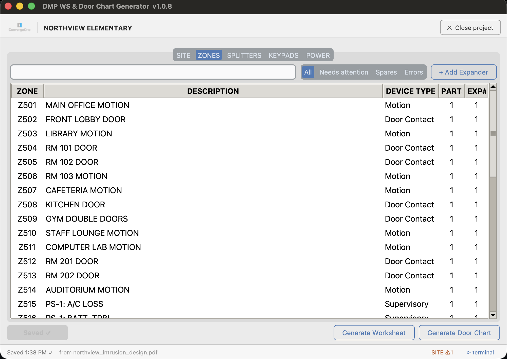
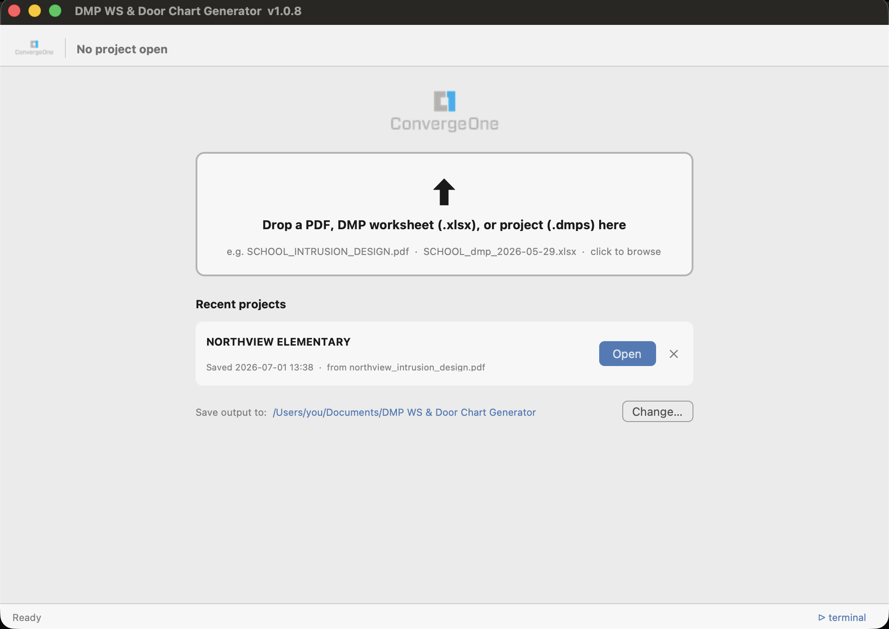
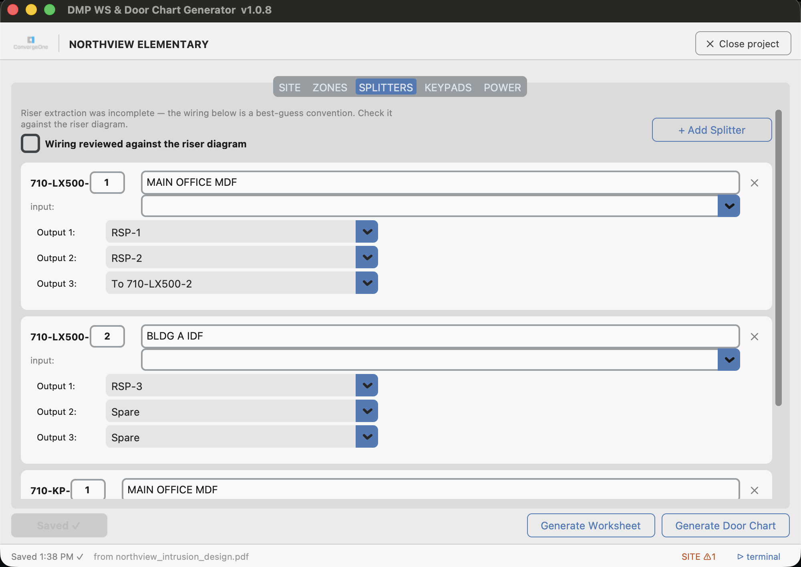
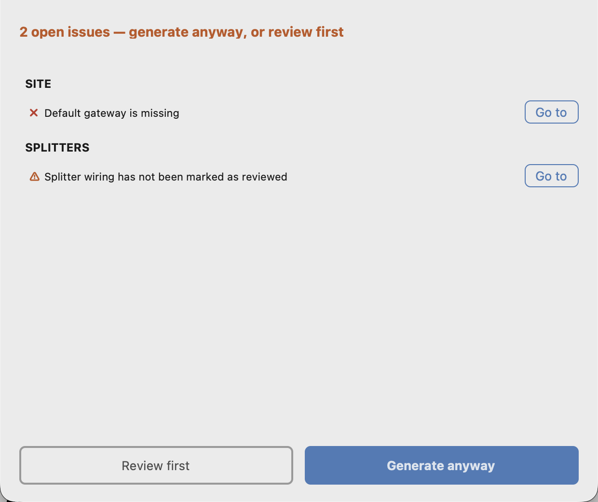
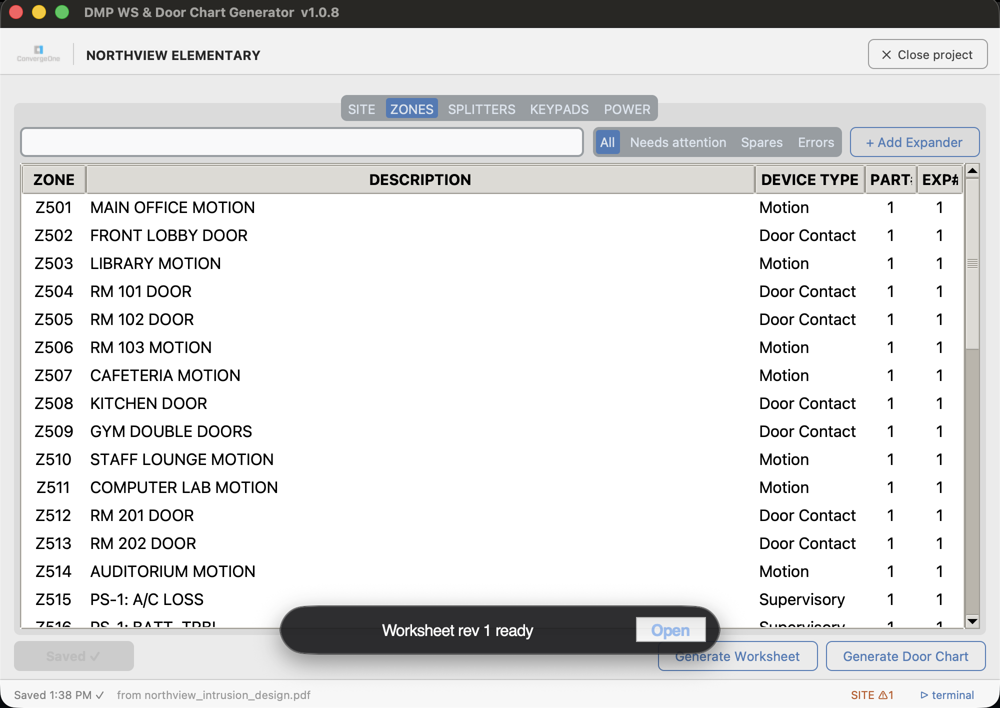

# DMP WS & Door Chart Generator

Desktop app (macOS + Windows) that turns a security-system design PDF into two
Excel deliverables: a **DMP Installation Worksheet** and a **Door Chart** —
with a built-in editor for correcting the design in the field before anything
is generated.



## What it does

**Inputs** (drag-and-drop or File → Open):

- a security design PDF (OCR'd automatically if it isn't searchable),
- an existing DMP worksheet (`.xlsx`), or
- a saved project (`.dmps`) from a previous visit.

**Outputs** — revision-numbered Excel files, generated on demand from the
editor:

- `school_dmp_rev1.xlsx`, `rev2`, … — the DMP Installation Worksheet
- `school_door_chart_rev1.xlsx`, … — the Door Chart, built from the newest
  worksheet

Prior revisions are kept on disk, so the working loop is: **generate → print →
review with the site superintendent → edit → regenerate.**

## Workflow

### 1. Import

Drop a file on the home screen. PDFs are OCR'd if needed, then parsed for the
zone schedule, splitter topology, RSPs, and keypads. The home screen lists
recent projects for one-click reopening across days and site visits.



### 2. Edit

Parsing lands in a tabbed editor — **SITE / ZONES / SPLITTERS / KEYPADS /
POWER** — which is the working document; the Excel files are artifacts
generated from it and are never re-imported.

- **ZONES** — searchable grid with inline editing and filter chips (All /
  Needs attention / Spares / Errors).
- **SPLITTERS** — the wiring topology, CAD-print conflict resolution, and a
  "Wiring reviewed against the riser diagram" checkbox.
- **Hardware changes** — add or remove **714-16/714-8 expanders** (each brings
  its RSP + power supply + zone block — DMP bus addressing: module 7 starts
  Z601), **710 splitters** (LX or KP), and **keypads**. Removal re-points
  dependent wiring to Spare and pops a review summary that routes you to the
  affected connections. Location fields autocomplete from locations already in
  the project. Template capacities are enforced: 15 expanders, 12 splitters
  per type, 28 keypads.
- **Validation** runs live (status-bar chips per tab: required IP/gateway/
  tech/date, no blank or placeholder zone descriptions, `RSP-N`/`SPARE`
  naming, conflicts resolved, wiring reviewed). It warns — it never blocks.



### 3. Generate

Two buttons at the bottom of the editor (also Worksheet menu / keyboard):

- **Generate Worksheet** (`Cmd/Ctrl+E`) — writes the next worksheet revision.
- **Generate Door Chart** (`Cmd/Ctrl+D`) — builds the chart from the newest
  worksheet, warning if the design has changed since that worksheet was
  generated.

If validation issues are open you get a summary with "Go to" jumps — generate
anyway, or fix things first; your call.



Generation runs in the background — you stay in the editor the whole time, and
a notification offers to open the finished file.



## Projects & saving

Saving is explicit — the Save button or `Cmd/Ctrl+S` writes a `.dmps` project
file (plain JSON) under `<output>/Sessions/`. A debounced background recovery
file guards against crashes; unsaved work is offered for recovery on reopen.
In-app help lives under **Help → Field-Edit Workflow / Keyboard Shortcuts**,
plus hover tooltips on the less obvious controls.

## Repository layout

| Path | Purpose |
|---|---|
| `scripts/` | All Python source (one cross-platform copy) |
| `dmp_doorchart.spec` | PyInstaller build spec (OS-branched internally) |
| `requirements.txt` | Pinned dependencies — build with **Python 3.13** |
| `VERSION` | App version, shown in the title bar |
| `build_mac.command` / `build_windows.bat` | Per-machine build scripts |
| `.github/workflows/release.yml` | CI: builds both OSes on a version tag |
| `logos/`, `*.xlsx` | Branding assets and Excel templates |
| `docs/screenshots/` | README images (demo data only) |
| `docs/` | Design specs |

Build output, virtualenvs, and working data are **not** committed — see
`.gitignore`. One codebase runs on both operating systems — platform
differences are handled at runtime via `sys.platform` checks.

> **Data hygiene:** this repository is public. `input/` is gitignored on
> purpose — never commit real school design files, worksheets, or screenshots
> containing them. README screenshots use a fabricated demo project.

## Developer setup (new machine)

1. Install **Python 3.13** and **Git** (or GitHub Desktop).
2. Install the OCR tools:
   - macOS: `brew install tesseract ghostscript`
   - Windows: Tesseract-OCR (UB Mannheim build) and Ghostscript, default paths.
3. Clone this repo (anywhere **outside** OneDrive, e.g. `~/Projects/`).
4. Build:
   - macOS: double-click `build_mac.command` → app installed to `~/Applications/`
   - Windows: double-click `build_windows.bat` → app folder copied to your Desktop
5. Launch the built app.

The build script creates its own virtualenv at `~/.dmp-doorchart/` (local, never
synced). First build takes a few minutes; rebuilds are faster.

**Updating:** `git pull`, then re-run the build script — or download a build
from GitHub Releases.

## Releasing

Push a version tag to build both platforms via CI and publish a Release:

```
# bump VERSION first (e.g. to 1.0.9), commit, then:
git tag v1.0.9
git push origin v1.0.9
```

GitHub Actions builds the macOS `.app` and Windows `.exe` and attaches both to a
GitHub Release for that tag. The Release is the version archive. CI fails fast if
the pushed tag doesn't match the `VERSION` file, so the two can't drift.

## Auto-update

Once a colleague has any packaged build installed, it **updates itself** — no more
re-sending zips. On launch (throttled to once/day) the app checks the public
GitHub Releases API; if a newer release exists it shows an *"Update available"*
dialog with the release notes and an **Update Now** button that downloads the new
build, swaps the running app in place, and relaunches. There's also a manual
**Help → Check for Updates…** menu item.

Because the app downloads the update itself, the new build opens **without** the
Gatekeeper / SmartScreen warning seen on the first manual install. Releasing is
unchanged: bump `VERSION`, tag `vX.Y.Z`, push — every existing install picks it up.
(The updater is stdlib-only; see `scripts/updater.py`.)

## Sharing with a colleague (Windows, no install)

The Windows build is a **self-contained app folder** — it bundles Python, all
libraries, and the OCR tools (Tesseract + Ghostscript). The recipient needs
nothing installed. It ships as a `.zip` (one folder holding the `.exe` plus an
`_internal/` folder of bundled files).

To share: download `DMP-WS-Door-Chart-Generator-Windows.zip` from the GitHub
Release and send it over **Teams** (email servers block executables). They:

1. Save the `.zip` and **extract it** (right-click → Extract All). Keep the
   `.exe` and the `_internal/` folder together — the app needs both.
2. Open the extracted folder and double-click the `.exe`.
3. If Windows SmartScreen shows "Windows protected your PC", click
   **More info → Run anyway** (one click, not an install).

They never touch GitHub or the source code.

The build is deliberately **one-folder** (not one-file) and **UPX-free** so it
is not blocked by AppLocker `%TEMP%` rules or flagged as a false positive by
antivirus on managed/corporate Windows machines.

## Output location

Generated worksheets and door charts are written to a folder the user picks
in-app (**"Save output to → Change…"**), stored per machine. The default is
`~/Documents/DMP WS & Door Chart Generator/`. Each generate writes the next
`_revN` file rather than overwriting, so earlier revisions stay available for
comparison. Point the folder at OneDrive to sync deliverables across machines,
or keep it local.
